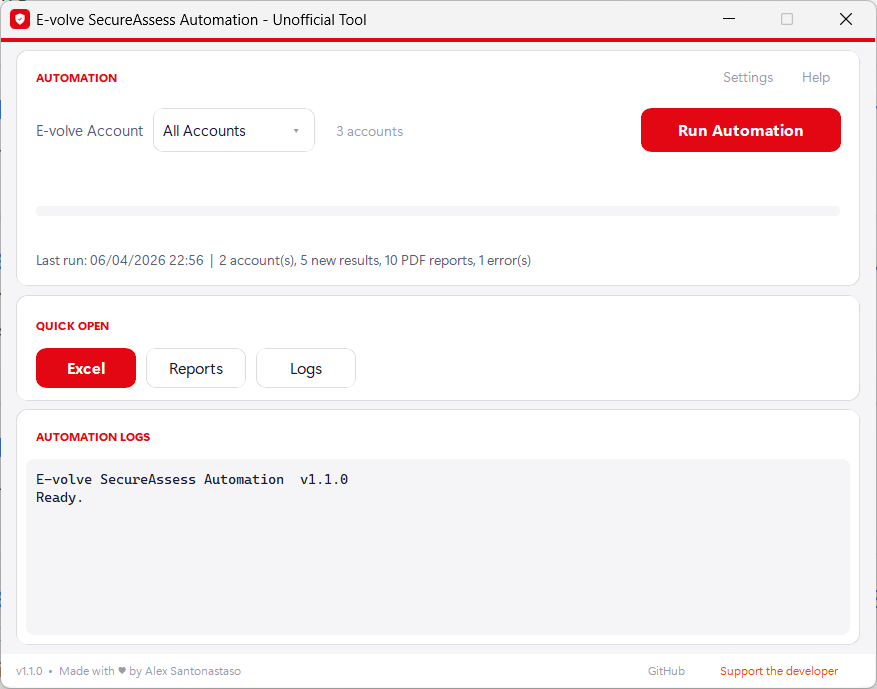

# E-volve SecureAssess Results Automation

Automatically download exam results and PDF reports from the City & Guilds E-volve SecureAssess platform. No more clicking through hundreds of candidates one by one.


<p align="center">
  
</p>

## What Does It Do?

If you work at an exam centre that uses City & Guilds E-volve, you know the pain: logging in, navigating the results table, noting down each candidate's results, downloading their PDF report, and repeating this dozens or hundreds of times.

This tool does all of that for you. You press one button and it:

- **Exports every result** into a clean, sorted Excel spreadsheet
- **Downloads every PDF report** into organised date folders
- **Handles multiple accounts** if your centre has more than one login
- **Picks up where it left off** - if you run it again, it only downloads what's new
- **Keeps your login safe** with AES-256 encryption (no plaintext passwords)

Everything is organised neatly by year so your records stay tidy.

## Getting Started

### Option 1: Download the app (recommended)

1. Download **`EvolveResultsAutomation.zip`** from the [latest release](https://github.com/snts42/evolve-results-automation/releases/latest)
2. Extract the zip into a dedicated folder (all data is saved alongside the app)
3. Run **`EvolveResultsAutomation.exe`** and create a master password
4. Add your E-volve login(s) in **Settings**
5. Click **Run Automation** and let it work

> **Note:** You need [Google Chrome](https://www.google.com/chrome/) installed. The app handles everything else automatically.

### Option 2: Run from source

```bash
git clone https://github.com/snts42/evolve-results-automation.git
cd evolve-results-automation
pip install -r requirements.txt
python -m evolve_results_automation
```

## Where Does Everything Go?

All data is organised by exam completion year:

```
EvolveResultsAutomation/
  EvolveResultsAutomation.exe
  _internal/
  credentials.enc
  analytics.xlsx
  2026/
    exam_results_2026.xlsx
    reports/
      03 15/
        John Smith Test Name Pass.pdf
    logs/
      03 15/
        log_2026-03-15_09-30-00.txt
```

- **Excel** - one spreadsheet per year with all candidate results, auto-sorted by date
- **Reports** - PDF reports grouped by the date they were completed
- **Logs** - detailed logs for every run, useful if something goes wrong

## Is It Secure?

Yes. Your E-volve login credentials are encrypted with **AES-256**, the same standard used by banks, and verified with HMAC-SHA256 to prevent tampering. They are protected by a master password you set on first launch.

- No plaintext passwords are ever written to disk
- The master password is only asked once per session
- If you forget your master password, click **"Forgot password? Reset here"** on the login screen to start fresh

## Technical Details

### Dependencies

All managed via `requirements.txt`:

- **selenium** - browser automation
- **openpyxl** - Excel reading, writing, and formatting
- **pyaes** - AES-256 credential encryption
- **customtkinter** - desktop GUI framework

### How It Works

The app uses Selenium to control a Chrome browser (headless by default) to log into the E-volve platform, navigate the results table, and extract data. PDF reports are downloaded directly via their document store URLs using Python's built-in `urllib`. Results are deduplicated using a hash of each candidate's core fields, so re-running is safe and only fetches new data.

## License

MIT. See [LICENSE](LICENSE.md) for details.

---

**Disclaimer:** This is an unofficial tool and is not affiliated with, endorsed by, or associated with City & Guilds. E-volve and SecureAssess are trademarks of The City and Guilds of London Institute.

**Author:** Alex Santonastaso | [santonastaso.me](https://santonastaso.me) | [Support the developer](https://ko-fi.com/alexsantonastaso)