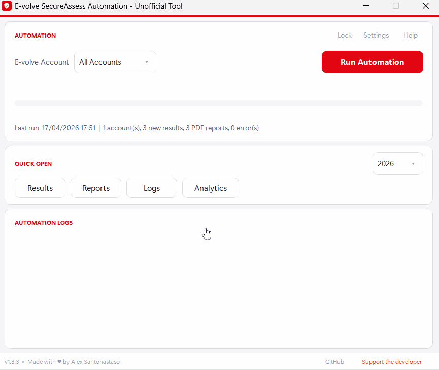
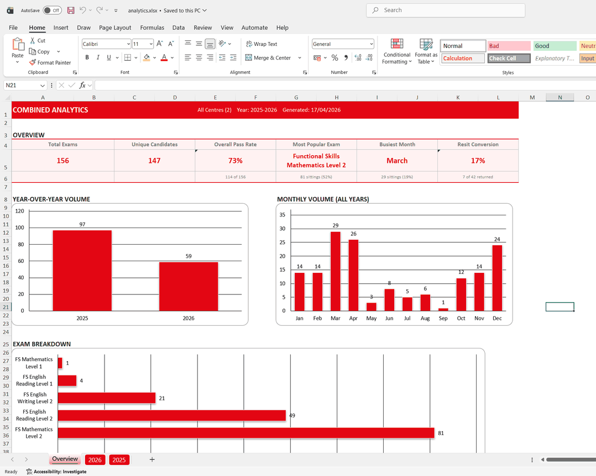
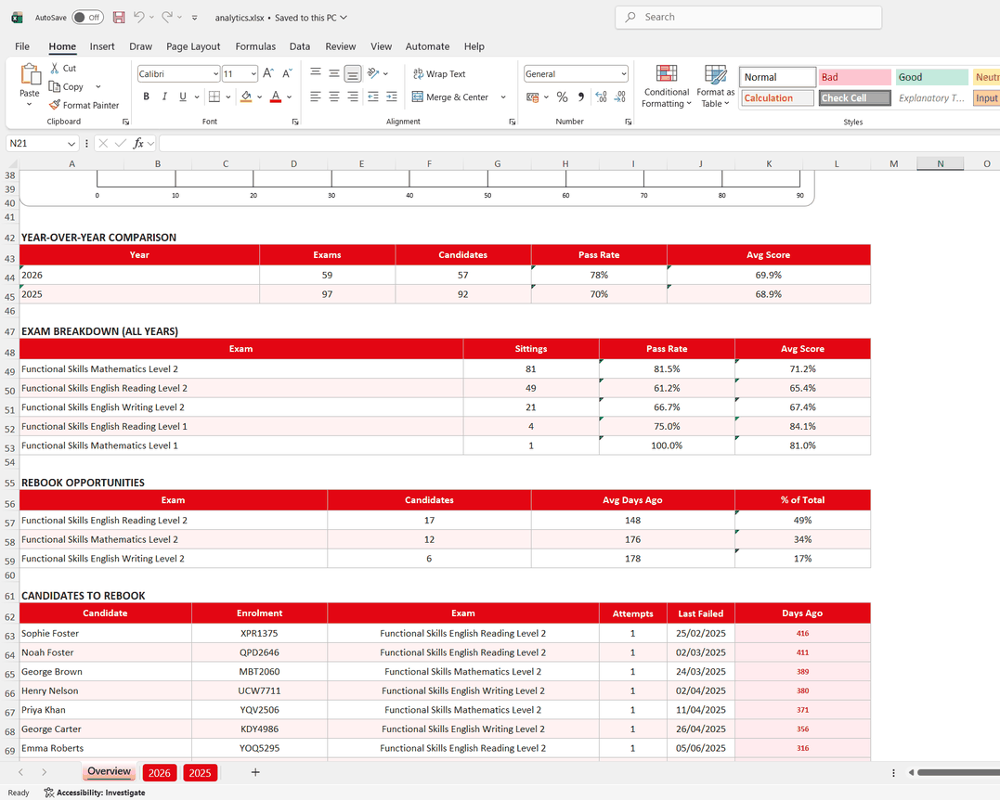
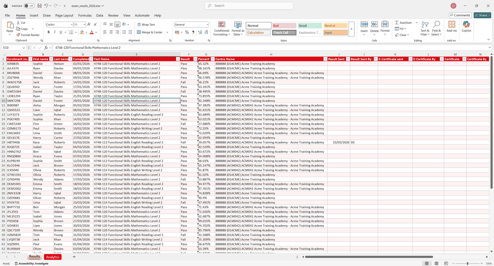

# E-volve SecureAssess Results Automation

Automatically download exam results and PDF reports from the City & Guilds E-volve SecureAssess platform. No more clicking through hundreds of candidates one by one.


<p align="center">
  
</p>

## What Does It Do?

If you administer City & Guilds E-volve at an exam centre, college, or training provider, you know the pain: logging in, navigating the results table, noting down each candidate's results, downloading their PDF report, and repeating this dozens or hundreds of times.

This tool does all of that for you. You press one button, or let it run on a schedule, and it:

- **Exports every result** into a clean, sorted Excel spreadsheet (one per year)
- **Downloads every PDF report** into organised date folders
- **Builds an analytics dashboard** with pass rates, resit conversions, busiest months, and candidates to rebook
- **Runs on a schedule** so results are ready on your desk every morning
- **Lives in the system tray** with desktop notifications when a run finishes
- **Handles multiple accounts** if your centre has more than one login
- **Picks up where it left off** so re-runs only fetch what's new
- **Lets you view results without unlocking** in read-only mode
- **Keeps your login safe** with AES-256 encryption (no plaintext passwords)

Everything is organised neatly by year so your records stay tidy.

## Analytics Dashboard

<p align="center">
  
</p>

Every run regenerates an Analytics tab with six KPI cards (total exams, unique candidates, pass rate, resit conversion, most popular exam, busiest month), a monthly volume chart, an exam breakdown chart, a rebook opportunities table, and an extra-time candidates list. Once you have two or more years of data, a combined `analytics.xlsx` workbook is also generated with an Overview tab that aggregates across years.

<p align="center">
  
</p>

The same sheet also surfaces a year-over-year pass rate comparison, a full exam breakdown table ranked by sittings, and a rebook opportunities list grouped by the exam each failed candidate needs to resit.

## Results Spreadsheet

<p align="center">
  
</p>

Each year's `exam_results_YYYY.xlsx` stores every scraped result with sortable columns and automatic de-duplication so re-runs only append what's new.

## Getting Started

### Option 1: Download the app (recommended)

1. Download **`EvolveResultsAutomation.zip`** from the [latest release](https://github.com/snts42/evolve-results-automation/releases/latest)
2. Extract the zip into a dedicated folder (all data is saved alongside the app)
3. Run **`EvolveResultsAutomation.exe`** and create a master password
4. Add your E-volve login(s) in **Settings**
5. Click **Run Automation** and let it work

> **Note:** You need [Google Chrome](https://www.google.com/chrome/) installed. The app handles everything else automatically.

### Option 2: Run from source

```bash
git clone https://github.com/snts42/evolve-results-automation.git
cd evolve-results-automation
pip install -r requirements.txt
python -m evolve_results_automation
```

## Settings You Can Change

Open **Settings** (or press `Ctrl+S`) to configure:

- **Date range** - how far back to look each run (last month up to last 2.5 years)
- **Skip PDF downloads** - scrape data only, useful for quick checks
- **Show browser** - watch the automation happen in a visible Chrome window
- **Scheduler** - automatic daily run at a time you pick
- **Start with Windows** - launch the app when Windows boots
- **Desktop notifications** - toast when a run finishes
- **Minimise to tray** - close button hides to the system tray instead of quitting

## Where Does Everything Go?

All data is organised by exam completion year:

```
EvolveResultsAutomation/
  EvolveResultsAutomation.exe
  _internal/
  credentials.enc
  settings.json
  last_run.json
  analytics.xlsx
  2026/
    exam_results_2026.xlsx
    reports/
      06 15/
        Emma Smith 12345678 Functional Skills English Level 2 Pass.pdf
    logs/
      06 15/
        log_2026-06-15_09-30-00.txt
```

- **Excel per year** - one spreadsheet per year with all candidate results, auto-sorted by date, with an Analytics tab
- **Combined analytics** - `analytics.xlsx` aggregates across years (generated when 2+ years exist)
- **Reports** - PDF reports grouped by the date they were completed. Filenames include the candidate's enrolment number to prevent collisions
- **Logs** - detailed logs for every run, useful if something goes wrong
- **Credentials** - AES-256 encrypted, never stored in plaintext
- **Settings** - your preferences (scheduler, date range, tray, notifications) persist between sessions

## Is It Secure?

Yes. Your E-volve login credentials are encrypted with **AES-256-CBC**, the same standard used by banks, and protected by a master password you set on first launch.

- **Master password stretched with PBKDF2-SHA256** (100,000 iterations) before being used as the encryption key
- **HMAC-SHA256** over IV + ciphertext detects tampering or wrong-password attempts before any data is decrypted
- **Atomic writes** for credentials, settings, PDFs, and Excel files (tempfile + rename) so a crash mid-write cannot corrupt anything on disk
- **No plaintext passwords** are ever written to disk or sent over the network
- **Master password is only asked once per session** - the app never stores it
- Forgot your master password? Click **"Forgot password? Reset here"** on the login screen to start fresh

## Technical Details

### Dependencies

Runtime (via `requirements.txt`):

- **selenium** - browser automation
- **openpyxl** - Excel reading, writing, and formatting
- **pyaes** - AES-256 credential encryption
- **customtkinter** - desktop GUI framework
- **winotify** - Windows desktop notifications
- **pystray** - system tray icon and menu
- **Pillow** - icon handling for the tray and notifications

Development only (via `requirements-dev.txt`):

- **pytest** - test runner

### How It Works

The app uses Selenium to control a Chrome browser (headless by default) to log into the E-volve platform, navigate the results table, and extract data. PDF reports are downloaded directly via their document store URLs using Python's built-in `urllib`. Results are deduplicated using a hash of each candidate's core fields, so re-running is safe and only fetches new data. Excel writes are atomic (tempfile + rename) so a crash during save cannot leave a corrupt `.xlsx` on disk, with an additional `.bak` snapshot kept as a one-version rollback.

### Testing

The test suite covers the pure helper functions that matter for data integrity: unique row hashing, PDF cutoff date math, PDF filename generation (including the collision regression), date formatting, and credential encryption round-trip.

```bash
pip install -r requirements-dev.txt
python -m pytest tests/ -v
```

## License

MIT. See [LICENSE](LICENSE.md) for details.

---

**Disclaimer:** This is an unofficial tool and is not affiliated with, endorsed by, or associated with City & Guilds. E-volve and SecureAssess are trademarks of The City and Guilds of London Institute.

**Author:** Alex Santonastaso | [santonastaso.me](https://santonastaso.me) | [Support the developer](https://ko-fi.com/alexsantonastaso)